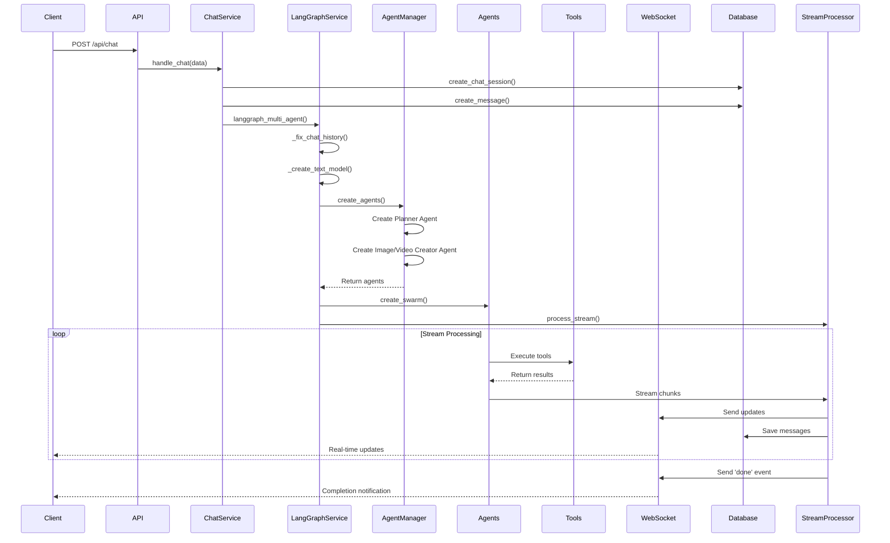
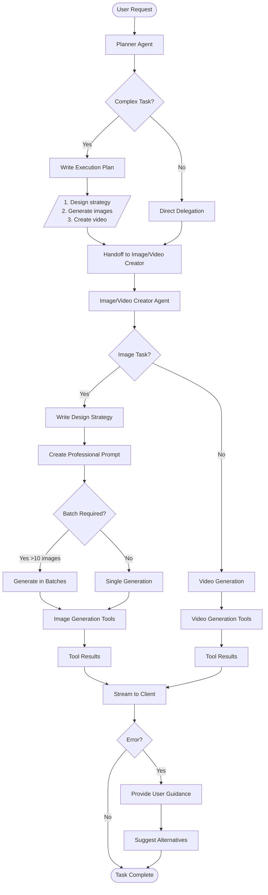

# LangGraph Architecture Documentation

## Overview

This repository implements a multi-agent system using LangGraph for AI-powered image and video generation. The system is built on a FastAPI backend with WebSocket support for real-time streaming and a React frontend.

## Architecture Components

### 1. Server Architecture

```
/server
├── main.py                 # FastAPI entry point with WebSocket integration
├── routers/               # API endpoints
│   ├── chat_router.py     # Chat API endpoints
│   ├── websocket_router.py # WebSocket handling
│   └── ...
├── services/              # Core business logic
│   ├── langgraph_service/ # LangGraph implementation
│   │   ├── agent_service.py      # Main agent orchestration
│   │   ├── agent_manager.py      # Agent creation and management
│   │   ├── StreamProcessor.py    # Stream handling for responses
│   │   └── configs/              # Agent configurations
│   │       ├── base_config.py
│   │       ├── planner_config.py
│   │       └── image_vide_creator_config.py
│   ├── chat_service.py    # Chat orchestration
│   ├── tool_service.py    # Tool registration and management
│   └── websocket_service.py # WebSocket communication
└── tools/                 # Available tools/functions
    ├── write_plan.py
    ├── generate_image_*.py
    └── generate_video_*.py
```

### 2. Core Components

#### 2.1 Agent Service (`agent_service.py`)
- **Purpose**: Main entry point for LangGraph multi-agent system
- **Key Functions**:
  - `langgraph_multi_agent()`: Orchestrates the entire agent workflow
  - `_fix_chat_history()`: Fixes incomplete tool calls in chat history
  - `_create_text_model()`: Creates language model instances (OpenAI/Ollama)
  - `_handle_error()`: Error handling and WebSocket notification

#### 2.2 Agent Manager (`agent_manager.py`)
- **Purpose**: Creates and manages different types of agents
- **Key Classes**:
  - `AgentManager`: Static class for agent creation
- **Key Methods**:
  - `create_agents()`: Creates all configured agents
  - `_create_langgraph_agent()`: Creates individual LangGraph agents
  - `get_last_active_agent()`: Determines which agent was last active

#### 2.3 Stream Processor (`StreamProcessor.py`)
- **Purpose**: Handles streaming responses from agents
- **Key Features**:
  - Real-time WebSocket updates
  - Tool call tracking
  - Message persistence to database
  - Support for different chunk types (values, messages, tool calls)

#### 2.4 Agent Configurations (`configs/`)
- **Base Configuration**: Defines base agent structure with handoff capabilities
- **Planner Agent**: Responsible for task planning and delegation
- **Image/Video Creator Agent**: Handles image and video generation tasks

### 3. Agent Types

#### 3.1 Planner Agent
- **Role**: Task decomposition and planning
- **Tools**: `write_plan`
- **Handoffs**: Can transfer to `image_video_creator`
- **Behavior**:
  1. Analyzes complex tasks
  2. Creates execution plans
  3. Delegates to specialized agents

#### 3.2 Image/Video Creator Agent
- **Role**: Generate images and videos
- **Tools**: All registered image and video generation tools
- **Features**:
  - Design strategy documentation
  - Batch generation support
  - Input image detection
  - Error handling with user guidance

### 4. Tool System

#### 4.1 Tool Registration
- Tools are registered in `tool_service.py`
- Each tool has:
  - Unique ID
  - Display name
  - Type (image/video)
  - Provider
  - Tool function

#### 4.2 Tool Types
- **System Tools**: `write_plan`
- **Image Generation Tools**: Various providers (GPT, Flux, Midjourney, etc.)
- **Video Generation Tools**: Multiple providers (Kling, Hailuo, Seedance, etc.)

### 5. Communication Flow

#### 5.1 Request Flow
1. Client sends request to `/api/chat`
2. `chat_router` receives request
3. `chat_service` processes the request
4. `langgraph_multi_agent` is invoked
5. Agents process the task
6. Results stream back via WebSocket

#### 5.2 WebSocket Events
- `delta`: Text streaming
- `tool_call`: Tool invocation notification
- `tool_call_arguments`: Streaming tool arguments
- `tool_call_result`: Tool execution results
- `all_messages`: Complete message history
- `done`: Task completion
- `error`: Error notifications

## End-to-End Execution Flow



## Agent Reasoning Flow



## LangGraph Integration Details

### 1. Dependencies
- `langgraph==0.4.8`: Core LangGraph framework
- `langgraph-checkpoint==2.0.26`: State management
- `langgraph-prebuilt==0.2.2`: Pre-built components
- `langgraph-sdk==0.1.70`: SDK utilities
- `langgraph-swarm==0.0.11`: Multi-agent swarm functionality

### 2. Key LangGraph Features Used

#### 2.1 Agent Creation
```python
from langgraph.prebuilt import create_react_agent

agent = create_react_agent(
    name=config.name,
    model=model,
    tools=[*business_tools, *handoff_tools],
    prompt=config.system_prompt
)
```

#### 2.2 Swarm Creation
```python
from langgraph_swarm import create_swarm

swarm = create_swarm(
    agents=agents,
    default_active_agent=last_agent if last_agent else agent_names[0]
)
```

#### 2.3 Handoff Mechanism
- Uses `Command` objects for agent transitions
- Metadata-based handoff destinations
- Tool-based handoff implementation

#### 2.4 Stream Processing
- Supports multiple stream modes: "messages", "custom", "values"
- Real-time chunk processing
- State management across agent transitions

### 3. State Management
- Messages are persisted to database
- Chat history is maintained and fixed for consistency
- Agent transitions are tracked
- Tool calls and results are stored

### 4. Error Handling
- Comprehensive error catching at multiple levels
- User-friendly error messages
- Graceful fallbacks for tool failures
- WebSocket error notifications

## Configuration and Customization

### 1. Adding New Agents
1. Create a new config class in `configs/`
2. Extend `BaseAgentConfig`
3. Define system prompt, tools, and handoffs
4. Register in `AgentManager.create_agents()`

### 2. Adding New Tools
1. Create tool function in `tools/`
2. Register in `TOOL_MAPPING` in `tool_service.py`
3. Add to appropriate agent configuration

### 3. Modifying Agent Behavior
- Update system prompts in agent configs
- Adjust handoff conditions
- Modify tool selection logic

## Performance Considerations

1. **Stream Processing**: Efficient chunked streaming reduces latency
2. **Database Operations**: Asynchronous database writes
3. **WebSocket Communication**: Real-time updates without polling
4. **Tool Execution**: Parallel tool execution where possible
5. **Error Recovery**: Graceful handling prevents system crashes

## Security Considerations

1. **Tool Confirmation**: Certain tools require user confirmation
2. **Input Validation**: Chat history fixing prevents injection
3. **API Keys**: Managed through config service
4. **SSL Support**: HTTPS/WSS communication
5. **Session Management**: Unique session IDs for isolation