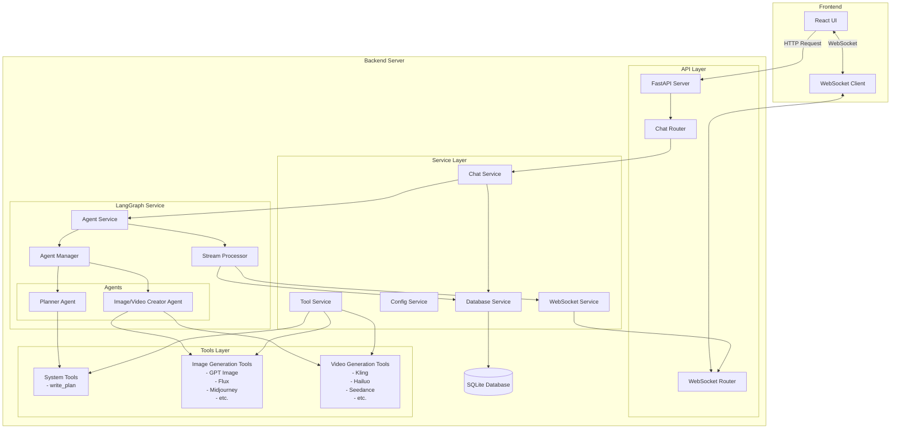
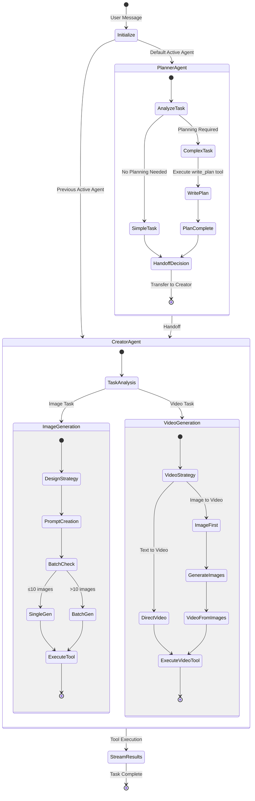
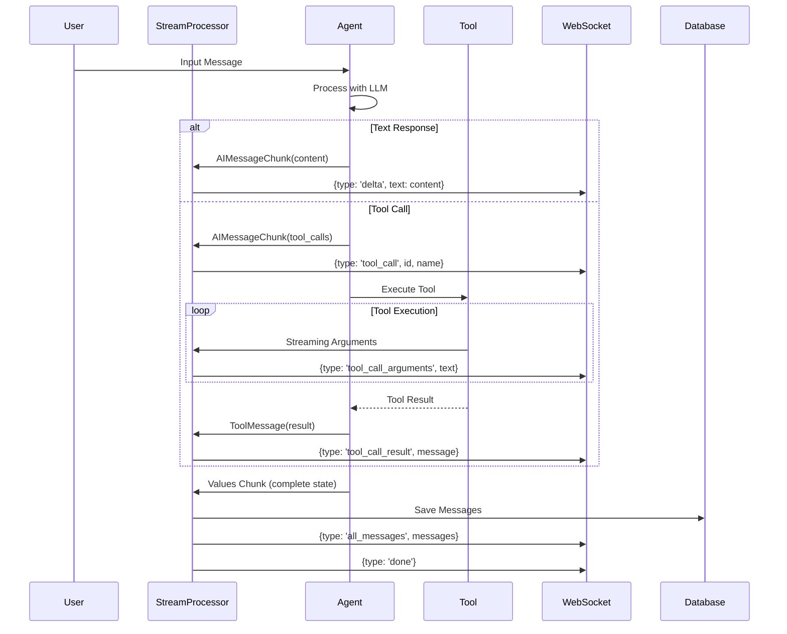
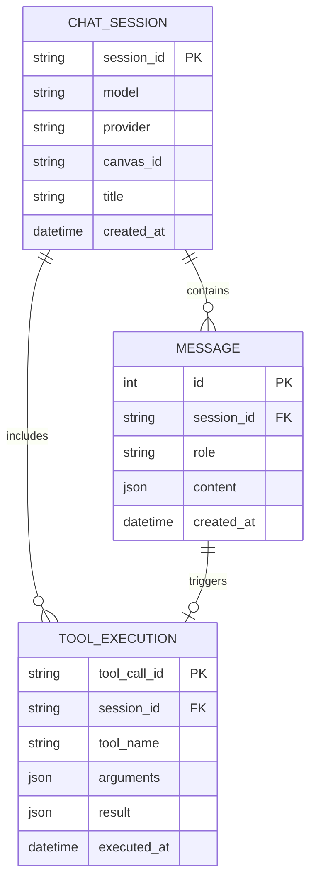

# LangGraph Architecture Diagrams

## 1. High-Level System Architecture



## 2. LangGraph Agent State Machine



## 3. Message Flow and Stream Processing



## 4. Tool Integration Architecture

```mermaid
graph LR
    subgraph "Tool Registration"
        ToolMapping[TOOL_MAPPING<br/>Dictionary]
        ToolInfo[Tool Info<br/>- ID<br/>- Display Name<br/>- Type<br/>- Provider<br/>- Function]
    end
    
    subgraph "Tool Service"
        GetTool[get_tool()]
        Initialize[initialize()]
        FilterTools[Filter by Type]
    end
    
    subgraph "Agent Configuration"
        PlannerTools[Planner Tools<br/>- write_plan]
        CreatorTools[Creator Tools<br/>- All Image Tools<br/>- All Video Tools]
    end
    
    subgraph "LangChain Integration"
        BaseTool[LangChain BaseTool]
        ToolWrapper[Tool Wrapper<br/>with Context]
    end
    
    ToolMapping --> ToolInfo
    ToolInfo --> GetTool
    
    Initialize --> FilterTools
    FilterTools --> PlannerTools
    FilterTools --> CreatorTools
    
    GetTool --> BaseTool
    BaseTool --> ToolWrapper
    
    PlannerTools --> Agent1[Planner Agent]
    CreatorTools --> Agent2[Creator Agent]
```

## 5. Handoff Mechanism

```mermaid
flowchart TB
    subgraph "Handoff Tool Creation"
        HandoffConfig[Handoff Configuration<br/>- agent_name<br/>- description]
        CreateHandoff[create_handoff_tool()]
        HandoffTool[Transfer Tool<br/>transfer_to_agent_name]
    end
    
    subgraph "Handoff Execution"
        AgentCall[Agent calls handoff tool]
        ToolMessage[Create ToolMessage<br/>'Successfully transferred']
        Command[Create Command<br/>- goto: target_agent<br/>- update: messages + active_agent]
    end
    
    subgraph "Swarm Processing"
        SwarmRouter[Swarm Router]
        TargetAgent[Target Agent Activation]
        ContinueExecution[Continue with new agent]
    end
    
    HandoffConfig --> CreateHandoff
    CreateHandoff --> HandoffTool
    
    HandoffTool --> AgentCall
    AgentCall --> ToolMessage
    ToolMessage --> Command
    
    Command --> SwarmRouter
    SwarmRouter --> TargetAgent
    TargetAgent --> ContinueExecution
```

## 6. Error Handling Flow

```mermaid
flowchart TD
    Start([Agent Execution]) --> Try{Try Block}
    
    Try -->|Success| Process[Process Normally]
    Try -->|Error| Catch[Catch Exception]
    
    Catch --> ErrorType{Error Type}
    
    ErrorType -->|Tool Error| ToolError[Tool Execution Failed]
    ErrorType -->|API Error| APIError[External API Failed]
    ErrorType -->|System Error| SystemError[Internal Error]
    
    ToolError --> UserGuidance[Provide User Guidance<br/>- Sensitive content warning<br/>- Alternative suggestions]
    APIError --> RetryAdvice[Suggest Retry<br/>- Check service status<br/>- Try different approach]
    SystemError --> LogError[Log Full Traceback]
    
    UserGuidance --> SendError[Send Error via WebSocket]
    RetryAdvice --> SendError
    LogError --> SendError
    
    SendError --> WSMessage[{type: 'error', error: message}]
    WSMessage --> Client([Client Notification])
    
    Process --> Complete([Task Complete])
```

## 7. Database Integration



## 8. Configuration Flow

```mermaid
graph TD
    subgraph "Agent Configuration"
        BaseConfig[BaseAgentConfig<br/>- name<br/>- tools<br/>- system_prompt<br/>- handoffs]
        
        PlannerConfig[PlannerAgentConfig<br/>Extends BaseConfig]
        CreatorConfig[ImageVideoCreatorConfig<br/>Extends BaseConfig]
    end
    
    subgraph "Runtime Creation"
        AgentManager[AgentManager]
        CreateReactAgent[create_react_agent()]
        CompiledGraph[CompiledGraph]
    end
    
    subgraph "Swarm Assembly"
        AgentList[List of Agents]
        CreateSwarm[create_swarm()]
        ActiveSwarm[Active Swarm<br/>with default agent]
    end
    
    BaseConfig --> PlannerConfig
    BaseConfig --> CreatorConfig
    
    PlannerConfig --> AgentManager
    CreatorConfig --> AgentManager
    
    AgentManager --> CreateReactAgent
    CreateReactAgent --> CompiledGraph
    
    CompiledGraph --> AgentList
    AgentList --> CreateSwarm
    CreateSwarm --> ActiveSwarm
```