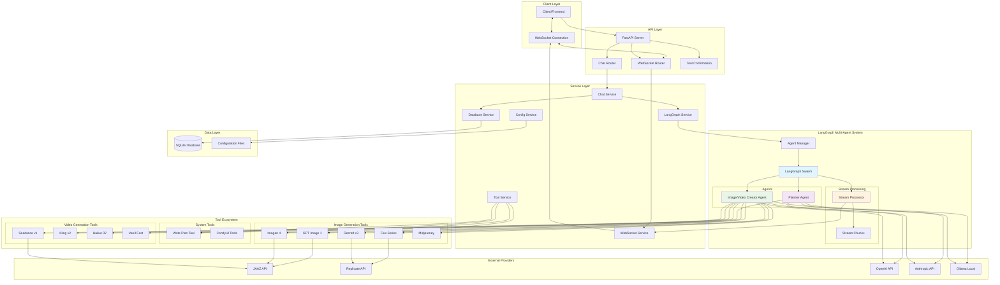
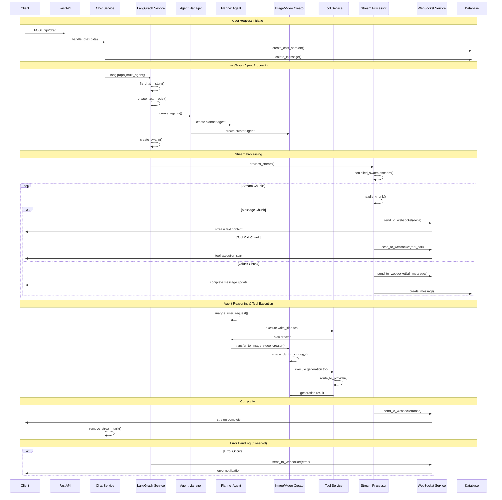
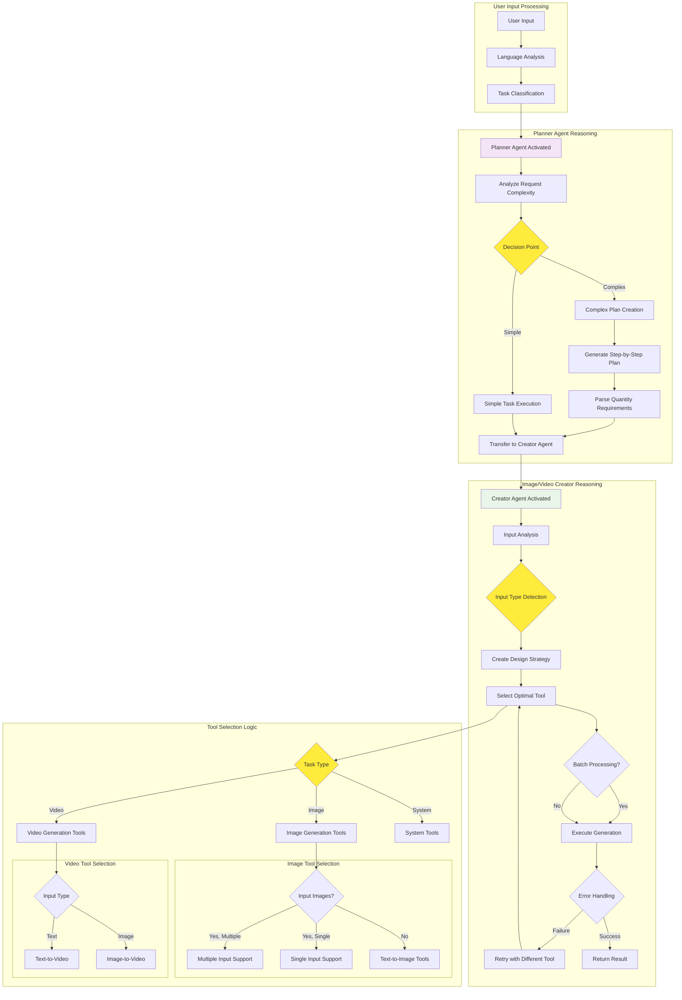
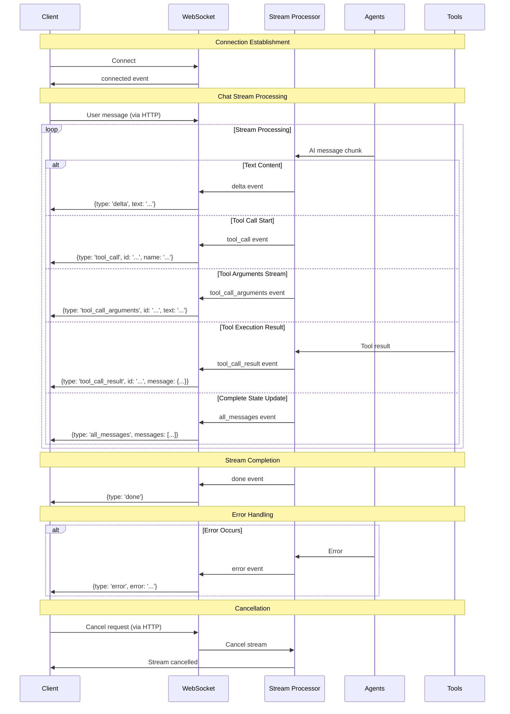
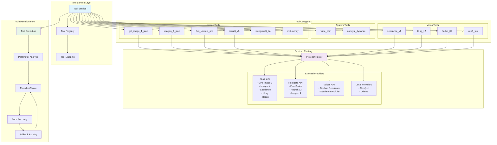
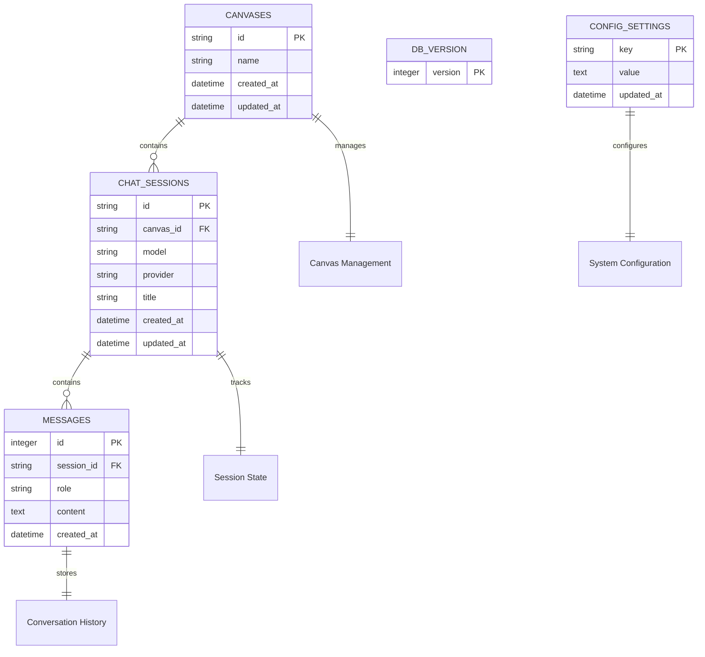

# LangGraph Architecture Mermaid Diagrams

## 1. Overall System Architecture

## 2. End-to-End Execution Flow

## 3. Agent Reasoning Flow

## 4. WebSocket Communication Pattern

## 5. Tool Architecture and Provider Routing

## 6. Database Schema and Data Flow

This comprehensive set of mermaid diagrams illustrates the complete LangGraph architecture, from high-level system overview down to specific execution flows and data relationships. The architecture demonstrates sophisticated multi-agent orchestration with real-time streaming, robust error handling, and extensible tool management.